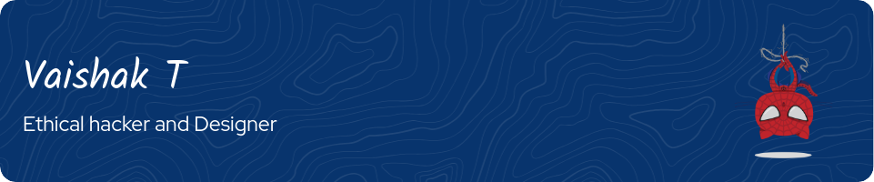

<body style="font-family: Arial, sans-serif; line-height: 1.6; margin: 20px;">
    <h1 style="color: #333;">About Me 👨‍💻</h1>
    
Hello! I'm <strong>Vaishak T</strong>, a dedicated and passionate Cyber Security enthusiast from Coimbatore, India. Currently, I'm pursuing my B.E. in Computer Science at <strong>DR.N.G.P. Institute of Technology</strong>, with a CGPA of 7.6. My journey into the world of technology started early and has been enriched by my academic endeavors and hands-on experiences in the field of cybersecurity.

    
  <h2 style="color: #333;">🎓 Education</h2>
    <ul>
        <li><strong>B.E. in Computer Science</strong> | DR.N.G.P. Institute of Technology (Nov 2021 - Present)</li>
        <li><strong>HSC in Computer Science</strong> | GRD-CPF (March 2019 - July 2021)</li>
    </ul>
    
  <h2 style="color: #333;">💼 Experience</h2>
    <ul>
        <li><strong>CTF Player</strong> | TryHackMe (January 2023 - Present)
            <ul>
                <li>Actively participating in Capture The Flag (CTF) challenges on TryHackMe, which allows me to hone practical cybersecurity skills through hands-on challenges and real-world scenarios.</li>
            </ul>
        </li>
    </ul>
    
  <h2 style="color: #333;">🛠️ Skills</h2>
    <ul>
        <li><strong>Programming Languages:</strong> C, SQL, Python</li>
        <li><strong>Libraries/Frameworks:</strong> Javascript</li>
        <li><strong>Tools/Platforms:</strong> Adobe Photoshop, Burpsuite, Kali Linux, TryHackMe</li>
    </ul>
    
  <h2 style="color: #333;">🚀 Projects / Open-Source Contributions</h2>
    <ul>
        <li><strong>SHA_XK MALWARE</strong>
            <ul>
                <li>Developed advanced malware using C and C++, incorporating techniques like shellcode and DLL injection for discreet program manipulation.</li>
                <li>Rewrote NTDLL functionalities to optimize system-level interactions, demonstrating expertise in low-level programming.</li>
            </ul>
        </li>
    </ul>
    
  <h2 style="color: #333;">📜 Certifications</h2>
    <ul>
        <li>Windows Privilege Escalation for Beginners - TCM Security</li>
        <li>Linux Privilege Escalation for Beginners - TCM Security</li>
        <li>IBM Introduction to Cloud Computing - Coursera</li>
        <li>Front End Apps with React Js - YardStick</li>
    </ul>
    
  
I am committed to continuous learning and exploring new technologies. My GitHub repositories reflect my journey and passion for cybersecurity and programming. Feel free to explore my projects, and connect with me if you share similar interests or have opportunities for collaboration.

    
  <h2 style="color: #333;">📞 Contact</h2>
    <ul>
        <li><strong>Email:</strong> thangarajk178@gmail.com</li>
        <li><strong>Phone:</strong> +91 9629822438</li>
    </ul>
    
  
Let's connect and collaborate on GitHub! 🤝

</body>

